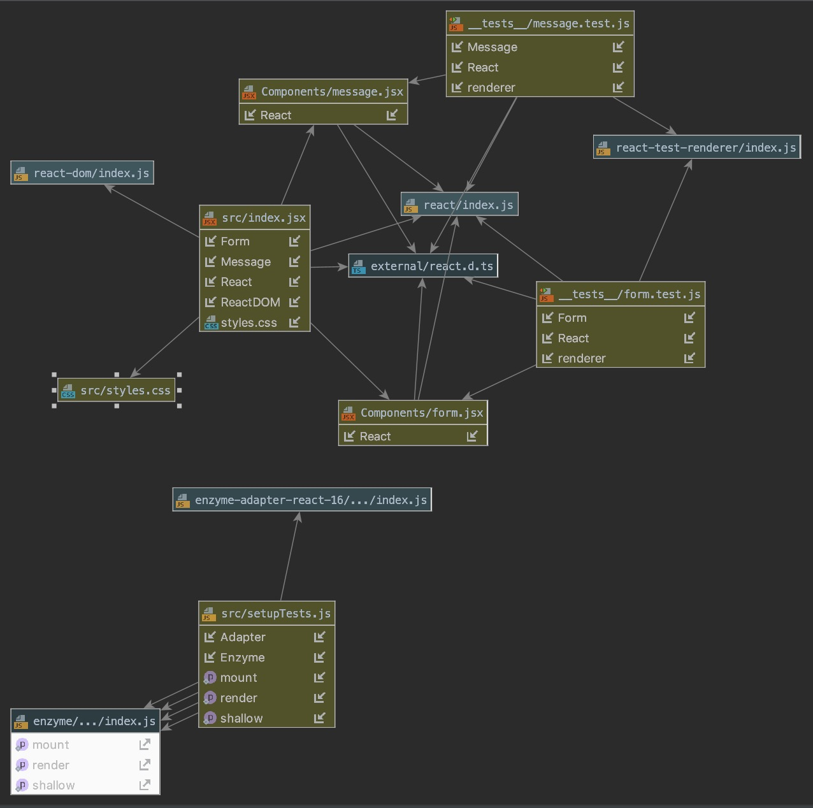

# LAB - 28

## Class-28

### Author: Benjamin Clark

### Props and State
* [submission PR Challenge 1](https://github.com/benjamin-401-advanced-javascript/class-27/pull/2)
* [submission PR Challenge 2](https://github.com/benjamin-401-advanced-javascript/class-27/pull/2)
* [submission PR Challenge 3](https://github.com/benjamin-401-advanced-javascript/class-27/pull/2)

#### Documentation
* [api docs](http://xyz.com) (API servers)
* [documentation](http://localhost:6060/) (Server assignments)
* [styleguide](http://xyz.com) (React assignments)

#### Running the app
* `npm start`
* Endpoint: `/`
  * Creates a category then console logs it.

  
#### Tests
* "test": "react-scripts test --env=jsdom",
* "start": "react-scripts start",
* "lint": "eslint src/**/*.js" -tried to lint but linter was going crazy. Errors not referencing proper code lines

#### UML

